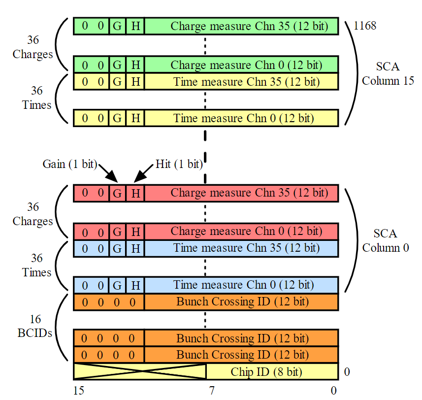

SSP2E数据包解析说明

数据包的包头为0xfa5a，包尾为0xfeee,中间为数据。中间的数据格式为（从上往下看）：

一个SCA代表着一个存储单元，总计16个SCA，每个SCA里包含了36个通道的电荷信号和时间（TDC）信号，此外有16个BCID用于记录粗略的时间信息，最后是芯片的ChipID。这是一个全满的数据包，它的总的比特为：

    (16*36 + 16*36) * 16(data) + 16*16(BCID) + 16(ChipID)

但并不是每个数据包都是满的，也有不满的，也就是16个SCA中只有部分SCA数据，例如只有5个SCA有数据，那么这个不满的数据包的总的比特为：
   
    (16*36 + 16*36) * 5 + 16*5(BCID) + 16(ChipID)

每个SCA对应着一个BCID，在解析时需要注意。

目前没用TDC，对于现在而言，上图中都是电荷信号，只不过增益不同(HG/LG，每个SCA里HG在上LG在下)。

下面对每个数据（16bit）进行说明，最高的两位固定是0，G是增益位（HG为1，LG为0，先目前HG+LG模式下没意义），H为触发位，代表着这个数据通道是被触发的。后12个bit为电荷信号的ADC码值，BCID暂时不用，CHIPID目前定为0x0001，用于数据包的核验。

注：每次只有一个通道被触发，其它通道会一起采数。

        解析一个SSP2E数据包
        THE FOEMAT OF SOURCE:
        ---------DATA PART-------------
        NAME    ROW     SIZE    LOCAL
        HAED    1ROW    2Bytes  0-1         0xFA 0x5A
        HGain   36ROW   72Bytes 2-73        0 0 G H | Charge(12bit)
        LGain   36ROW   72Bytes 74-145      0 0 G H | Charge(12bit)
        BCID    1ROW    2Bytes  146-147
        ChipID  1ROW    2Bytes  148-149
        Temp    1ROW    2Bytes  150-151
        Trigger 1ROW    2Bytes  151-153
        TAIL    1ROW    4Bytes  154-157     0xFE 0xEE 0xFE 0xEE
        TOTAL SIZE: 158
        *********DECODED DATA*********
        NAME            LENGTH
        CHARGE          36
        Temp            1
        TrigID          1
        TOTAL LENGTH:   38
        ===============================

       || HEAD   |  HGain  |  LGain  |  BCID  | ChipID |  Temp  | TriggeID |  TAIL  | XXXXXX ||
       || 2Bytes | 72Bytes | 72Bytes | 2Bytes | 2Bytes | 2Bytes | 2Bytes   | 4Bytes | 8Bytes ||
       ||  0--1  |  2--73  | 74--145 | 146-147|148-149 |150-151 | 152-153  | 154-157| 158-165||

        ======THE FORMAT OF SOURCE=====
        ---------DATA PART-------------
        NAME    ROW     SIZE    LOCAL
        HAED    1ROW    2Bytes  0-1
        HGain   36ROW   72Bytes 2-73
        LGain   36ROW   72Bytes 74-145
        BCID    1ROW    2Bytes  146-147
        ChipID  1ROW    2Bytes  148-149
        Temp    1ROW    2Bytes  150-151
        Trigger 1ROW    2Bytes  151-153
        TAIL    1ROW    4Bytes  154-157
        ---------STATUS PART-----------
        TrigDAC 1ROW    2Bytes  158-159 0-1
        INDAC   1ROW    2Bytes  160-161 2-3
        TrigMode1ROW    2Bytes  162-163 4-5
        BoardID 1ROW    2Bytes  164-165 6-7
        TOTAL SIZE: 166
       || HEAD   |  HGain  |  LGain  |  BCID  | ChipID |  Temp  | TriggeID |  TAIL  | TrigDAC | INDAC  | TrigMode | BoardID ||
       || 2Bytes | 72Bytes | 72Bytes | 2Bytes | 2Bytes | 2Bytes | 2Bytes   | 4Bytes | 2Bytes  | 2Bytes |   2Bytes | 2Bytes  ||
       ||  0--1  |  2--73  | 74--145 | 146-147|148-149 |150-151 | 152-153  | 154-157| 158-159 | 160-161| 162-163 | 164 -165 ||
